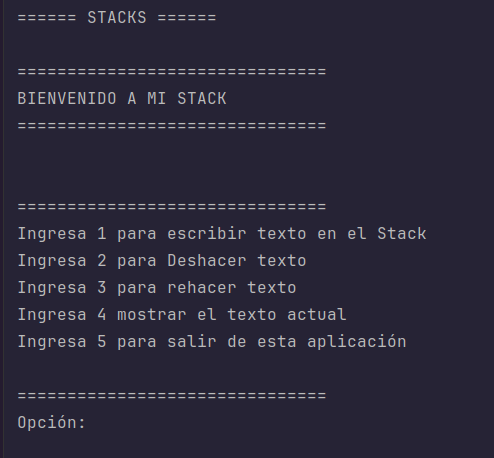
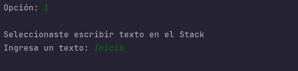
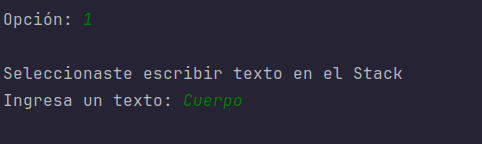
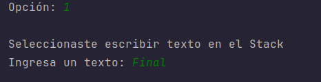
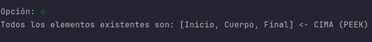
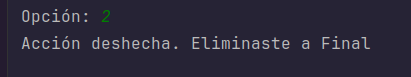
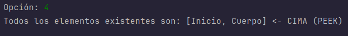
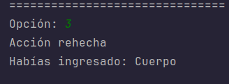
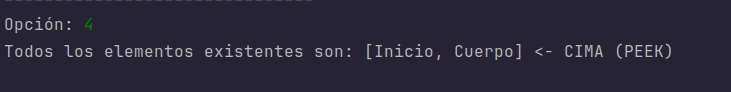

# Simulador de Editor de Texto (Undo/Redo) con Stacks en Java 

Este proyecto es una aplicación de consola en Java que simula las funciones de **Deshacer (Undo)** y **Rehacer (Redo)** típicas de un editor de texto.

El objetivo principal es demostrar la comprensión teórica y práctica de la estructura de datos **Pila (Stack)** utilizando la lógica **LIFO** (*Last In, First Out*).

##  Objetivo del Proyecto
Que los estudiantes comprendan el concepto de pila y su estructura, siendo capaces de aplicarlo en un simulador funcional de *Undo/Redo* implementado manualmente en Java, fomentando el trabajo en equipo y las buenas prácticas de control de versiones.

## Estructura y Funcionamiento
El proyecto no utiliza la clase genérica `java.util.Stack`. En su lugar, se implementó una clase `Stack` personalizada apoyada en un `ArrayList` para manejar la memoria dinámicamente.

El sistema funciona orquestando **dos pilas**:
1.  **Pila Principal (Undo):** Almacena el historial de textos ingresados.
2.  **Pila Secundaria (Redo):** Actúa como memoria temporal para almacenar los elementos que son "deshechos", permitiendo recuperarlos posteriormente.

### Métodos implementados en la clase `Stack`:
* `push(String value)`: Inserta un elemento en la cima.
* `pop()`: Extrae y devuelve el elemento de la cima.
* `peek()`: Devuelve el elemento de la cima sin extraerlo.
* `isEmpty()`: Verifica si la pila está vacía.

## Instrucciones de Ejecución

### Prerrequisitos
* Tener instalado **Java Development Kit (JDK)** versión 8 o superior.
* Una terminal o consola de comandos, o un IDE como IntelliJ IDEA, Eclipse o NetBeans.

### Pasos para ejecutar
1.  Clona este repositorio en tu máquina local:
    ```bash
    git clone https://github.com/dageorge29/Actividad_1.2.git
    ```
2.  Navega hasta el directorio del proyecto donde se encuentran los archivos `.java`. 

    Nota: O abre el directorio `.src` para encontrarlo directamente, el código principal se encuentra en la `.class` Main
3.  Compila los archivos Java:
    ```bash
    javac Main.java Stack.java
    ```
4.  Ejecuta el programa principal:
    ```bash
    java Main
    ```
5.  Sigue las instrucciones del menú interactivo en la consola.

# Capturas de Pantalla de la Ejecución Real

## Llenar el stack
* **Menú de inicio y escritura:
  


* Ingresar texto:
  




* Mostrar el texto actual (peek (cima)). El ultimo elemento es el primero en salir (cima):



##Probar el Undo (Deshacer)
* Probar el Undo (Deshacer):


* Mostrar elementos actuales:
Ahora el penúltimo elemento que entró ocupa la cima.



## Probar el Redo (Rehacer)
Recuperar a Cuerpo:


* Mostrar los elementos actuales:


## Desarrollador

* Jorge Andrés Murillo Rivera


---
*Desarrollado como actividad académica para la comprensión de Estructuras de Datos.*
